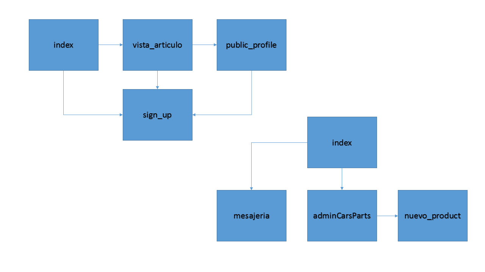
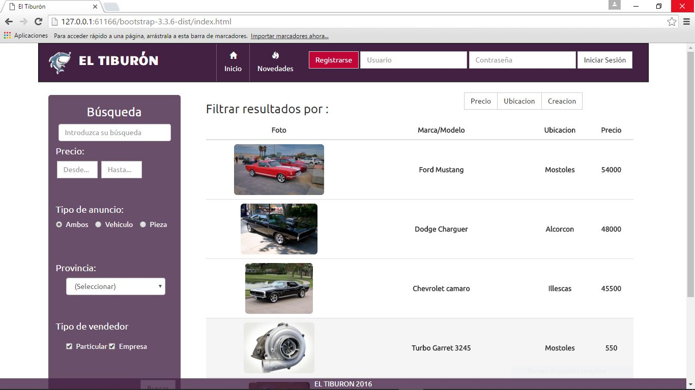
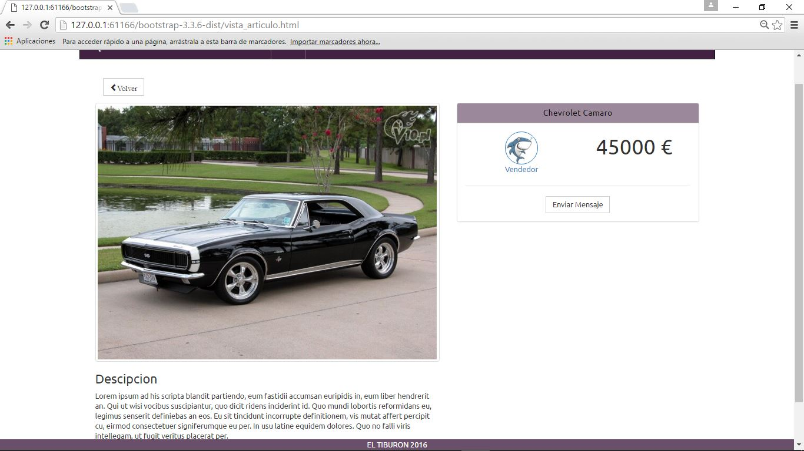
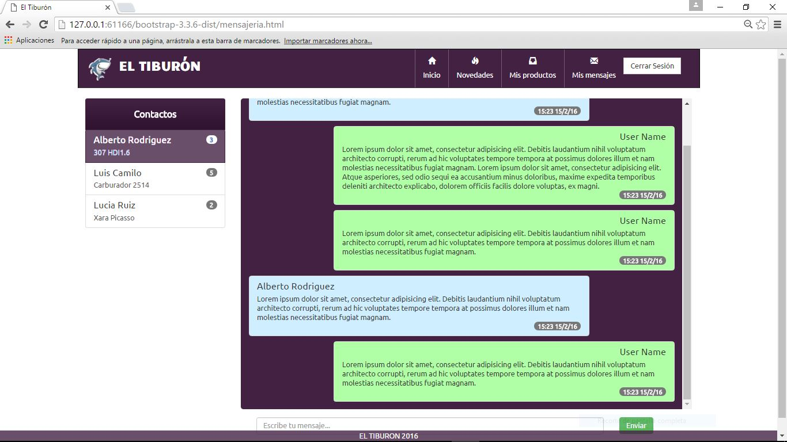
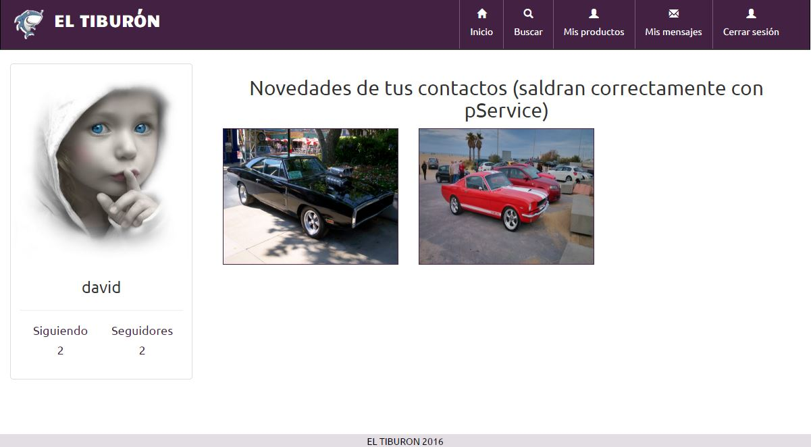
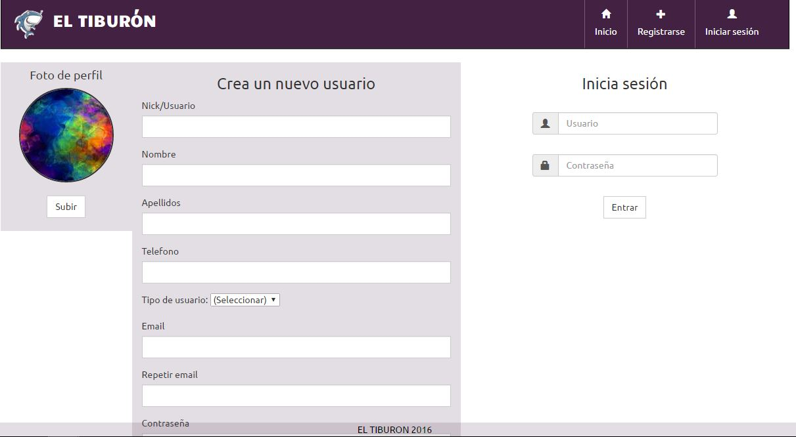
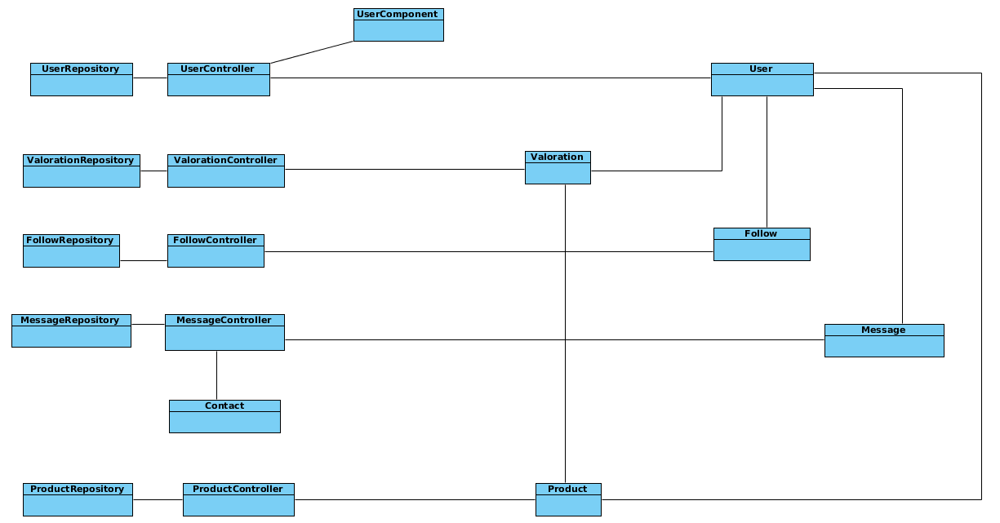
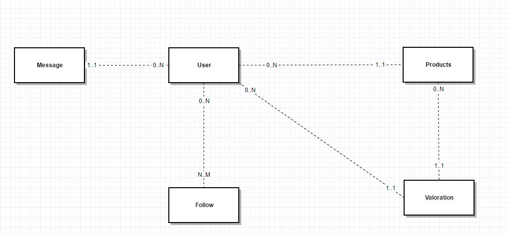

Vehiculos y Recambios el Tiburón 
================================

###Descripción

Es una aplicación web que permite anunciar la compra/venta de vehículos y piezas de automóvil para 
particulares y empresas.

La parte pública consiste en la búsqueda y visualización de los diferentes anuncios.

La parte privada permitirá crear y editar anuncios, crear y editar vehiculos y piezas y el envío y 
recibo de mensajes referentes a un anuncio en concreto.

###Entidades principales

Usuario:

>Nombre

>Apellidos 

>Correo

>Telefono

>Tipo de Usuario

Vehiculo:

>Estado
	
>Tipo: moto, turismo, furgón
	
>NºPuertas: 3, 4, 5
	
>Combustible: diésel,biodiesel, gasolina, hibrido, eléctrico
	
>Cambio: manual, automatico
	
>Color: rojo, blanco, negro….
	
>Extras(si/no): (D.asistida, abs, esp, A.Acondicionado,climatizador(¿bizona?), 
Elevalunas eléctricos, cierre centralizado)
	
>Precio:

>Fecha publicación
	
Piezas:
	
>Nombre
	
>Marca
	
>Ref
	
>Vehiculo compatible
	
>Precio

>Nuevo/2ªmano

>Fecha publicación

Mensajeria:

>Fecha

>Emisor
    
>Receptor
    
>Producto (id)
    
>Estado (no_leido | leido)

Compra/venta (valoraciones)

>Vendedor

>Comprador

>Producto

>Comentario

>Nota

	

Integrantes del equipo de desarrollo: Nombre, Apellidos, correo oficial de la universidad y
cuenta en GitHub:

>Cristian Velázquez Sánchez // c.velzquezs@alumnos.urjc.es // cvs4190

>Carlos Santos Morales // c.santosmo@alumnos.urjc.es // CSantosM

>David Villatobas Fernandez // d.villatobas@alumnos.urjc.es // dvillatobas

>Jorge Rodríguez Barreno // j.rodriguezbarr@alumnos.urjc.es // Naugh

###Información necesaria para descargar y ejecutar el último tag del repositorio:

El software que se deberá tener instalado es Brackets, desde ahi, con el proyecto importado, se podrá visualizar el index.html

###Fase 2

Este es el diagrama de navegación de la aplicación :

##Fase 3

Estas son algunas capturas de las principales pantallas de la aplicación: 

Diagrama de clases de la fase4:

